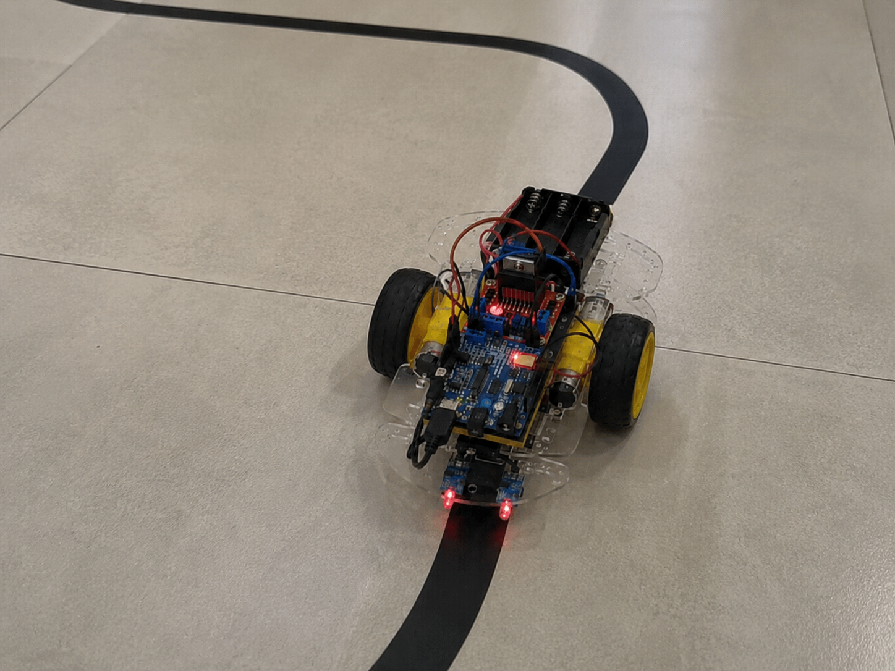

## Overview

Kraken is a line follower robot project designed with a modular firmware architecture. The system reads infrared sensors to detect the line position and uses a PID controller to continuously adjust the speed of each motor, keeping the robot centered on the track of the line, while trying to predict which direction should be followed when crossing two different lines.

The project is organized using PlatformIO and separated into independent modules:

- Sensors
- PID controller
- Motor control
- Main application

---

## Hardware

### Components

- Arduino Uno R3
- L298N Dual H-Bridge Driver
- 2x 6V DC Motors
- 2x Wheels
- Infrared Sensors Array
- 9V Power Supply

---

## Pin Configuration

### Sensors

| Sensor | Pin |
|----------|-----|
| S1 | A0 |
| S2 | A1 |
| S3 | A2 |
| S4 | A3 |
| S5 | A4 |

### Motor Driver (L298N)

| Function | Pin |
|------------|-----|
| ENA | 5 |
| ENB | 6 |
| IN1 | 8 |
| IN2 | 9 |
| IN3 | 10 |
| IN4 | 11 |

---

## Modules

### Sensors

Responsible for:

- Reading the infrared sensors.
- Calculating line position error.
- Detecting line loss.
- Providing input data for the PID controller.

---

### PID Controller

Responsible for:

- Proportional control (P).
- Integral control (I).
- Derivative control (D).
- Computing correction values.
- Adjusting left and right motor speeds.

Default parameters:

```cpp
Kp = 18.0;
Ki = 0.0;
Kd = 9.0;

baseSpeed = 130;
````


### Engine

Responsible for:

* Motor direction control.
* PWM speed control.
* Stop routines.
* Differential steering.

---

## PID Logic

The robot continuously computes:

```text
  integral      = integral + error, -INTEGRAL_LIMIT, INTEGRAL_LIMIT;
  derivative    = error - previousError;
  pid           = (Kp * error) + (Ki * integral) + (Kd * derivative);
  previousError = error;
```

Motor speeds:

```text
  leftSpeed  = dynamicBase + pid, 30.0f, 220.0f
  rightSpeed = dynamicBase - pid, 30.0f, 220.0f
```

This allows smooth corrections while following the line.

---

## Requirements

### 1. Visual Studio Code

Install:

* Visual Studio Code
* PlatformIO extension

---

### 2. PlatformIO

The project uses PlatformIO for building and uploading firmware.

Official website:

https://platformio.org/

---

### 3. Arduino Uno Drivers

Install the appropriate drivers if your board is not automatically recognized.

---

## Installation

Clone the repository:

```bash
git clone git@github.com:Matheus-Sounier/Kraken_arduino.git
```

Enter the project:

```bash
cd Kraken_arduino
```

Open the folder with Visual Studio Code.

PlatformIO will automatically download:

* AVR toolchain
* Arduino framework
* Required packages

---

## Build

Compile the firmware:

```bash
pio run
```

Or inside VSCode:

PlatformIO → Build

---

## Upload

Connect the Arduino Uno and upload:

```bash
pio run --target upload
```

Or:

PlatformIO → Upload

